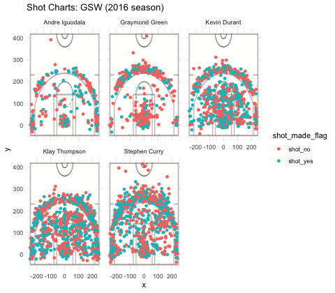

workout01-joo-kim
================
Joo Kim

``` r
# import package
library(dplyr)
```

    ## Warning: package 'dplyr' was built under R version 3.4.4

    ## 
    ## Attaching package: 'dplyr'

    ## The following objects are masked from 'package:stats':
    ## 
    ##     filter, lag

    ## The following objects are masked from 'package:base':
    ## 
    ##     intersect, setdiff, setequal, union

5) Report
=========

5.1) Effective Shooting Percentage
----------------------------------

``` r
# data type of each column
col_types <- c("NULL","character", "character",'integer','integer','integer','integer','character','character','character','integer','character','integer','integer','character','integer')

# reading "shots-data.csv" file with relative path
shots_data <- read.csv("../data/shots-data.csv", colClasses = col_types, stringsAsFactors = FALSE)
```

``` r
# data frame which only contains "Andre Iguodala" from name column
iguodala <- filter(shots_data, name == "Andre Iguodala")
```

    ## Warning: package 'bindrcpp' was built under R version 3.4.4

``` r
# data frame which only contains "Andre Iguodala" from name column and "2PT Field Goal" from shot_type column
iguodala2 <- filter(iguodala, shot_type == "2PT Field Goal")

# data frame which only contains "Andre Iguodala" from name column and "3PT Field Goal" from shot_type colomn
iguodala3 <- filter(iguodala, shot_type == "3PT Field Goal")

# data frame which only contains "Graymond Green" from name column
green <- filter(shots_data, name == "Graymond Green")

# data frame which only contains "Graymond Green" from name column and "2PT Field Goal" from shot_type column
green2 <- filter(green, shot_type == '2PT Field Goal')

# data frame which only contains "Graymond Green" from name column and "3PT Field Goal" from shot_type column
green3 <- filter(green, shot_type == '3PT Field Goal')

# data frame which only contains "Kevin Durant" from name column
durant <- filter(shots_data, name == "Kevin Durant")

# data frame which only contains "Kevin Durant" from name column and "2PT Field Goal" from shot_type column
durant2 <- filter(durant, shot_type == '2PT Field Goal')

# data frame which only contains "Kevin Durant" from name column and "3PT Field Goal" from shot_type column
durant3 <- filter(durant, shot_type == '3PT Field Goal')

# data frame which only contains "Klay Thompson" from name column
thompson <- filter(shots_data, name == "Klay Thompson")

# data frame which only contains "Klay Thompson" from name column and "2PT Field Goal" from shot_type column
thompson2 <- filter(thompson, shot_type == '2PT Field Goal')

# data frame which only contains "Klay Thompson" from name column and "3PT Field Goal" from shot_type column
thompson3 <- filter(thompson, shot_type == '3PT Field Goal')

# data frame which only contains "Stephen Curry" from name column
curry <- filter(shots_data, name == "Stephen Curry")

# data frame which only contains "Stephen Curry" from name column and "2PT Field Goal" from shot_type column
curry2 <- filter(curry, shot_type == '2PT Field Goal')

# data frame which only contains "Stephen Curry" from name column and "3PT Field Goal" from shot_type column
curry3 <- filter(curry, shot_type == '3PT Field Goal')
```

### 2PT Effective Shooting % by Player

``` r
# values of name column
name <- c("Andre Iguodala", "Graymond Green", "Kevin Durant", "Klay Thompson", "Stephen Curry")
```

``` r
# total shots from Andre Iguodala
iguodala2_total <- nrow(iguodala2)

# total shots from Graymond Green
green2_total <- nrow(green2)

# total shots from Kevin Durant
durant2_total <- nrow(durant2)

# total shots from Klay Thompson
thompson2_total <- nrow(thompson2)

# total shots from Stephen Curry
curry2_total <- nrow(curry2)

# values of total column
total2 <- c(iguodala2_total, green2_total, durant2_total, thompson2_total, curry2_total)
```

``` r
# made shots from Andre Iguodala
iguodala2_made <- nrow(filter(iguodala2, shot_made_flag == "shot_yes"))

# made shots from Graymond Green
green2_made <- nrow(filter(green2, shot_made_flag == "shot_yes"))

# made shots from Kevin Durant
durant2_made <- nrow(filter(durant2, shot_made_flag == "shot_yes"))

# made shots from Klay Thompson
thompson2_made <- nrow(filter(thompson2, shot_made_flag == "shot_yes"))

# made shots from Stephen Curry
curry2_made <- nrow(filter(curry2, shot_made_flag == "shot_yes"))

# values of made column
made2 <- c(iguodala2_made, green2_made, durant2_made, thompson2_made, curry2_made)
```

``` r
# values of perc_made column
perc_made2 <- c(iguodala2_made/iguodala2_total, green2_made/green2_total, durant2_made/durant2_total, thompson2_made/thompson2_total, curry2_made/curry2_total)
```

``` r
# create a table "2PT Effective Shooting % by Player"
effective_shooting2 <- data.frame("name" = name, "total" = total2, "made" = made2, "perc_made" = perc_made2)
effective_shooting2 <- arrange(effective_shooting2, desc(perc_made))
effective_shooting2
```

    ##             name total made perc_made
    ## 1 Andre Iguodala   210  134 0.6380952
    ## 2   Kevin Durant   643  390 0.6065319
    ## 3  Stephen Curry   563  304 0.5399645
    ## 4  Klay Thompson   640  329 0.5140625
    ## 5 Graymond Green   346  171 0.4942197

### 3PT Effective Shooting % by Player

``` r
# total shots from Andre Iguodala
iguodala3_total <- nrow(iguodala3)

# total shots from Graymond Green
green3_total <- nrow(green3)

# total shots from Kevin Durant
durant3_total <- nrow(durant3)

# total shots from Klay Thompson
thompson3_total <- nrow(thompson3)

# total shots from Stephen Curry
curry3_total <- nrow(curry3)

# values of total column
total3 <- c(iguodala3_total, green3_total, durant3_total, thompson3_total, curry3_total)
```

``` r
# made shots from Andre Iguodala
iguodala3_made <- nrow(filter(iguodala3, shot_made_flag == "shot_yes"))

# made shots from Graymond Green
green3_made <- nrow(filter(green3, shot_made_flag == "shot_yes"))

# made shots from Kevin Durant
durant3_made <- nrow(filter(durant3, shot_made_flag == "shot_yes"))

# made shots from Klay Thompson
thompson3_made <- nrow(filter(thompson3, shot_made_flag == "shot_yes"))

# made shots from Stephen Curry
curry3_made <- nrow(filter(curry3, shot_made_flag == "shot_yes"))

# values of made column
made3 <- c(iguodala3_made, green3_made, durant3_made, thompson3_made, curry3_made)
```

``` r
# values of perc_made column
perc_made3 <- c(iguodala3_made/iguodala3_total, green3_made/green3_total, durant3_made/durant3_total, thompson3_made/thompson3_total, curry3_made/curry3_total)
```

``` r
# create a table "3PT Effective Shooting % by Player"
effective_shooting3 <- data.frame("name" = name, "total" = total3, "made" = made3, "perc_made" = perc_made3)
effective_shooting3 <- arrange(effective_shooting3, desc(perc_made))
effective_shooting3
```

    ##             name total made perc_made
    ## 1  Klay Thompson   580  246 0.4241379
    ## 2  Stephen Curry   687  280 0.4075691
    ## 3   Kevin Durant   272  105 0.3860294
    ## 4 Andre Iguodala   161   58 0.3602484
    ## 5 Graymond Green   232   74 0.3189655

### Effective Shooting % by Player

``` r
# total shots from Andre Iguodala
iguodala_total <- nrow(iguodala)

# total shots from Graymond Green
green_total <- nrow(green)

# total shots from Kevin Durant
durant_total <- nrow(durant)

# total shots from Klay Thompson
thompson_total <- nrow(thompson)

# total shots from Stephen Curry
curry_total <- nrow(curry)

# values of total column
total <- c(iguodala_total, green_total, durant_total, thompson_total, curry_total)
```

``` r
# made shots from Andre Iguodala
iguodala_made <- nrow(filter(iguodala, shot_made_flag == "shot_yes"))

# made shots from Graymond Green
green_made <- nrow(filter(green, shot_made_flag == "shot_yes"))

# made shots from Kevin Durant
durant_made <- nrow(filter(durant, shot_made_flag == "shot_yes"))

# made shots from Klay Thompson
thompson_made <- nrow(filter(thompson, shot_made_flag == "shot_yes"))

# made shots from Stephen Curry
curry_made <- nrow(filter(curry, shot_made_flag == "shot_yes"))

# values of made column
made <- c(iguodala_made, green_made, durant_made, thompson_made, curry_made)
```

``` r
# values of perc_made column
perc_made <- c(iguodala_made/iguodala_total, green_made/green_total, durant_made/durant_total, thompson_made/thompson_total, curry_made/curry_total)
```

``` r
# create a table "Effective Shooting % by Player"
effective_shooting <- data.frame("name" = name, "total" = total, "made" = made, "perc_made" = perc_made)
effective_shooting <- arrange(effective_shooting, desc(perc_made))
effective_shooting
```

    ##             name total made perc_made
    ## 1   Kevin Durant   915  495 0.5409836
    ## 2 Andre Iguodala   371  192 0.5175202
    ## 3  Klay Thompson  1220  575 0.4713115
    ## 4  Stephen Curry  1250  584 0.4672000
    ## 5 Graymond Green   578  245 0.4238754

5.2) Narrative
--------------

Does Bastket Players' Popularity Related to Effective Shooting?
===============================================================

Golden State Warriors are constantly maintaining its reputation in NBA history Therefore, it is unsurprising that in 2017, Golden State Warriors's merchandise is the most popular among all the other basketball teams. Then here comes to the other question: who is the most popular player from Golden State Warriors? The number of jerseys sold out for each player can directly answer to this question. According to the NBA article, <https://www.nba.com/article/2017/06/29/stephen-curry-golden-state-warriors-top-most-popular-merchandise-lists>, Stephen Curry's jerseys were sold out most among all the GSW players.

### Top 5 Most Popular NBA Jerseys (only GSW)

Here are the ranks of top 15 most popular NBA Jerseys in 2017, just including players from GSW.

1st: Stepehn Curry

3rd: Kevin Durant

10th: Klay Thompson

11th: Draymond Green


Why are these players are so popular among NBA fans? Is it because they shoot really effectively during every games? Let's figure out if it's true that a player's effective shooting is related to his popularity.

### What We Will Examine

From now, we will examine five GSW players' shooting: Stephen Curry, Kevin Durant, Klay Thompson, Draymond Green. I have collected data of these players' performances during the season 2016. From the data, I created the data the number of total shootings, the number of shootings that were made, and the percentage of made shootings per player. We will also look at the shot charts from each player.

### Tables of Effective Shooting Percent by Player

Below table is Effective Shooting Percent by Player (overall)

``` r
effective_shooting
```

    ##             name total made perc_made
    ## 1   Kevin Durant   915  495 0.5409836
    ## 2 Andre Iguodala   371  192 0.5175202
    ## 3  Klay Thompson  1220  575 0.4713115
    ## 4  Stephen Curry  1250  584 0.4672000
    ## 5 Graymond Green   578  245 0.4238754

Among the five players, Kevin Durant has the most effective shooting percent, and then Andre Iguodala. Stephen Curry is the fourth effective shooter. Therefore, effective shooting percent does not really affect to a player's popularity.

However, if you examine the table closely, we should notice the number of shots that were made. Let's look at this table.

``` r
# Sorting above table by made column (descending order)
arrange(effective_shooting, desc(made))
```

    ##             name total made perc_made
    ## 1  Stephen Curry  1250  584 0.4672000
    ## 2  Klay Thompson  1220  575 0.4713115
    ## 3   Kevin Durant   915  495 0.5409836
    ## 4 Graymond Green   578  245 0.4238754
    ## 5 Andre Iguodala   371  192 0.5175202

Above table is the sorted version of Effective Shooting Percent by Player by number of made shots (descending order). As you can see, Stephen Curry made the most number of shots among five players. Since he also attempted the most number of shots, his effective shooting percent had to decrease.

### Visualization of Each Player's Shot



Above image is the visualization of each player's shot. From this image, we can observe that Stephen Curry, Klay Thompson, and Kevin Durant attempted numerous shots no matter what whether they made those shots or not. On the other hand, Andre Iguodala and Draymond Green attempted less number of shots. When you look at Curry's shot specifically, it is really impressive how one can try that many shoots during one season.

### Conclusion

It is true that a player has to be an effective shooter to contribute to the team's victory, and the effect shooting might affect a player's popularity. However, like Stephen Curry, the number of made shots is undoubtedly important even a player's effective shooting percent might decrease. That is why people are fanatical about Curry's every shots.

### Reference

(2017, Jun 29). Stephen Curry, Golden State Warriors top NBA's most popular merchandise lists <https://www.nba.com/article/2017/06/29/stephen-curry-golden-state-warriors-top-most-popular-merchandise-lists>
